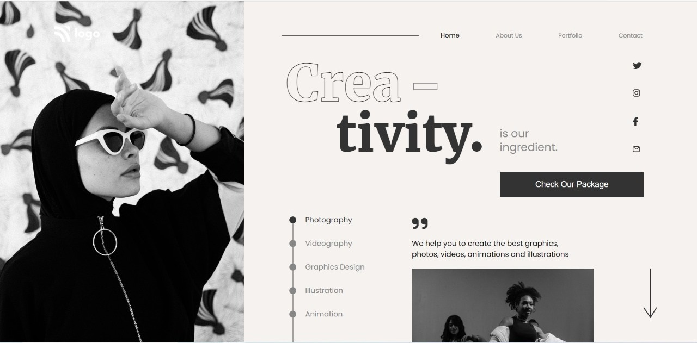

# Assignment-14 
## (Dance home Page) 

> In this project, I have used HTML (the Hypertext Markup Language) and CSS (Cascading Style Sheets), which are two of the core technologies for building Web pages. It is a static and non-responsive page.

### As a result of this project, I learn the following:
[LIVE-LINK](https://projectdance.netlify.app/)

- [x] use Absoulute and relative position
- [x] Learned to use text-stroke-width 
- [x] use font-awesome,z-index
- [x] learn about how to draw line ,circle,dotted line

#### The duration of the project:4 hour